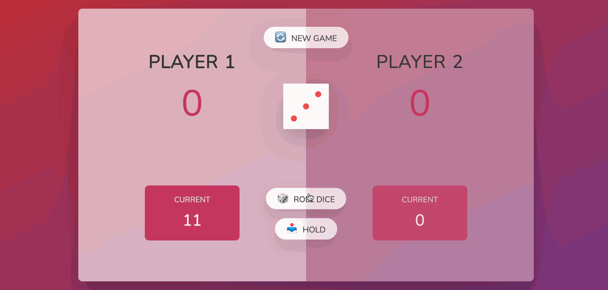

<h1>The pig game 🎲</h1>

<a href="https://github.com/dieegomr/Gess-my-number-game/blob/main/README_pt-BR.md">README.md</a> em português

This is a simple project part of <a href="https://www.udemy.com/course/the-complete-javascript-course/?utm_source=adwords&utm_medium=udemyads&utm_campaign=WebDevelopment_v.PROF_la.EN_cc.BR_ti.8322&utm_content=deal4584&utm_term=_._ag_108455848694_._ad_467154447027_._kw__._de_c_._dm__._pl__._ti_dsa-774930035449_._li_1031586_._pd__._&matchtype=&gclid=CjwKCAjw14uVBhBEEiwAaufYx9TbRKLGzNDmGQA8PAaGk99qGom4VgQpkeWedZuxHN_Cs1e6m0LX0BoCUJQQAvD_BwE">"The complete JavaScript Course 2022: From Zero to Expert"</a> where the idea was to keep practicing DOM manipulation, but a litlle bit more complex then on <a href="https://github.com/dieegomr/Gess-my-number-game">"Guess my number - Game"</a>

The HTML and CSS were ready, but it was necessary to implement the JavaScript code following the flowchart below.

<h3>How does this game work?</h3>

<ol>
<li>The player rolls the dice by clicking "Roll Dice";</li>
<li>The dice are displayed on the screen and if it is number 1 the player loses his current turn/current score and the another player can roll the dice. If it is not the number 1, the dice value is added to the current score;</li>
<li>The current player can click the "HOLD" button to add their current score to their general score and pass their turn;</li>
<li>The player who scores 100 points first wins the game.</li>
</ol>

<h3>Sample:</h3>

You can play <a href="https://dieegomr.github.io/the-pig-game/">here!</a>

<h3>How to run this game?</h3>

1) Clone the repository 

   $ git clone https://github.com/dieegomr/the-pig-game.git

2) Open the project folder

3) Open the index.html file

